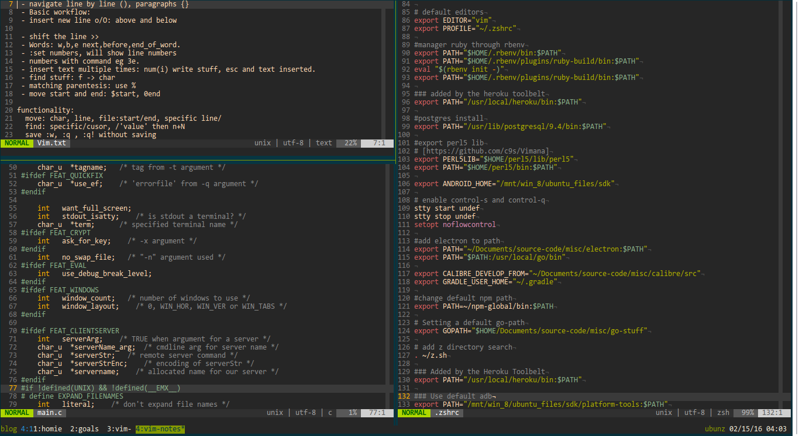

# dot-files
Hello there,

Thanks for stopping by. There is how I configured my coding environment.
	- z-shell : .zshrc

The old me used to track my whole home folder with git but now I am a changed man after I discoverd gnu-stow.
Also use a setup script to clone dependencies instead of using git submodules

#### Usage
- `cd $HOME` then `git clone https://github.com/colleowino/dot-files.git`
- Fetch dependencies: `./dotfiles/bash/setup`
- `sudo apt-get install stow`
	- Better to do this on a fresh install if not you will need to delete files that will then be replaced by these configs.
- `cd dot-files`
- `stow`
- Open vim and `PlugInstall` to pull all extensions via vim-plug

Basic environment configuration files:

- I use vim-gnome with gruvbox colors and [light line](https://github.com/itchyny/lightline.vim) as my status bar.

